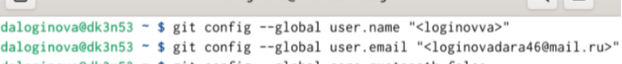
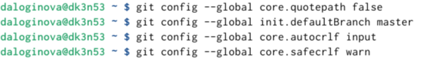
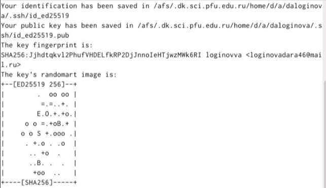
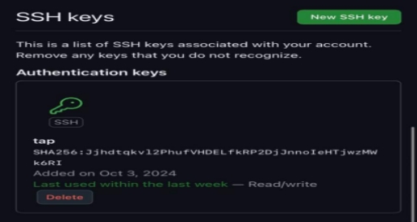
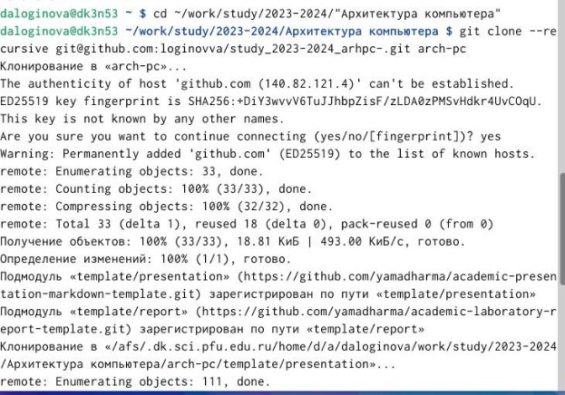
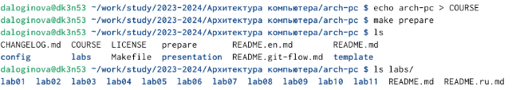
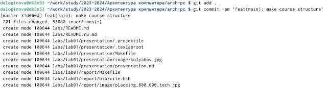
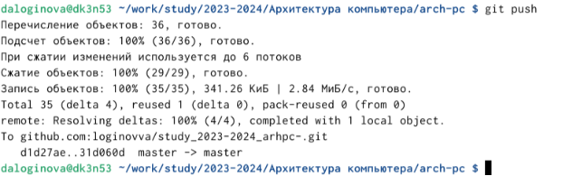
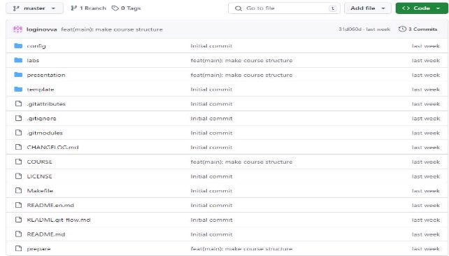

---
## Front matter
title: "Лабораторная работа №2. Система контроля
версий Git"
subtitle: "Архитектура компьютеров"
author: "Логинова дарья Алексеевна"

## Generic otions
lang: ru-RU
toc-title: "Содержание"

## Bibliography
bibliography: bib/cite.bib
csl: pandoc/csl/gost-r-7-0-5-2008-numeric.csl

## Pdf output format
toc: true # Table of contents
toc-depth: 2
lof: true # List of figures
lot: true # List of tables
fontsize: 12pt
linestretch: 1.5
papersize: a4
documentclass: scrreprt
## I18n polyglossia
polyglossia-lang:
  name: russian
  options:
	- spelling=modern
	- babelshorthands=true
polyglossia-otherlangs:
  name: english
## I18n babel
babel-lang: russian
babel-otherlangs: english
## Fonts
mainfont: IBM Plex Serif
romanfont: IBM Plex Serif
sansfont: IBM Plex Sans
monofont: IBM Plex Mono
mathfont: STIX Two Math
mainfontoptions: Ligatures=Common,Ligatures=TeX,Scale=0.94
romanfontoptions: Ligatures=Common,Ligatures=TeX,Scale=0.94
sansfontoptions: Ligatures=Common,Ligatures=TeX,Scale=MatchLowercase,Scale=0.94
monofontoptions: Scale=MatchLowercase,Scale=0.94,FakeStretch=0.9
mathfontoptions:
## Biblatex
biblatex: true
biblio-style: "gost-numeric"
biblatexoptions:
  - parentracker=true
  - backend=biber
  - hyperref=auto
  - language=auto
  - autolang=other*
  - citestyle=gost-numeric
## Pandoc-crossref LaTeX customization
figureTitle: "Рис."
tableTitle: "Таблица"
listingTitle: "Листинг"
lofTitle: "Список иллюстраций"
lotTitle: "Список таблиц"
lolTitle: "Листинги"
## Misc options
indent: true
header-includes:
  - \usepackage{indentfirst}
  - \usepackage{float} # keep figures where there are in the text
  - \floatplacement{figure}{H} # keep figures where there are in the text
---

# Цель работы

Изучить идеологию и применение средств контроля версий. Приобрести
практические навыки по работе с системой git.

# Задание

1. Создайте отчет по выполнению лабораторной работы в соответствующем каталоге
рабочего пространства (labs>lab02>report).
2. Скопируйте отчеты по выполнению предыдущих лабораторных работ в соответствующие каталоги созданного рабочего пространства.
3. Загрузите файлы на github.

# Теоретическое введение

Здесь описываются теоретические аспекты, связанные с выполнением работы.

Например, в табл. [-@tbl:std-dir] приведено краткое описание стандартных каталогов Unix.

: Описание некоторых каталогов файловой системы GNU Linux {#tbl:std-dir}

| Имя каталога | Описание каталога                                                                                                          |
|--------------|----------------------------------------------------------------------------------------------------------------------------|
| `/`          | Корневая директория, содержащая всю файловую                                                                               |
| `/bin `      | Основные системные утилиты, необходимые как в однопользовательском режиме, так и при обычной работе всем пользователям     |
| `/etc`       | Общесистемные конфигурационные файлы и файлы конфигурации установленных программ                                           |
| `/home`      | Содержит домашние директории пользователей, которые, в свою очередь, содержат персональные настройки и данные пользователя |
| `/media`     | Точки монтирования для сменных носителей                                                                                   |
| `/root`      | Домашняя директория пользователя  `root`                                                                                   |
| `/tmp`       | Временные файлы                                                                                                            |
| `/usr`       | Вторичная иерархия для данных пользователя                                                                                 |

Более подробно про Unix см. в [@tanenbaum_book_modern-os_ru; @robbins_book_bash_en; @zarrelli_book_mastering-bash_en; @newham_book_learning-bash_en].

# Выполнение лабораторной работы

 Создадим учётную запись на сайте https://github.com/ и заполним основные
данные. 

Сделаем предварительную конфигурацию git. Откроем терминал и введем
следующие команды, указав имя и email. (рис.1) [-@fig:001 ]
{ width=100% }

Настроим utf-8 в выводе сообщений git, зададим имя начальной ветки,
параметр autocrlf и параметр safecrlf. (рис.2) [-@fig:002 ]
 { width=100% }

Для последующей идентификации пользователя на сервере репозиториев
сгенерируем пару ключей и загрузим сгенерённый открытый ключ. (рис.3) [-@fig:003 ]
 { width=100% }

Скопировав из локальной консоли ключ в буфер обмена, вставляем ключ в
появившееся на сайте поле и указываем для ключа имя. (рис.4) [-@fig:004 ]
 { width=100% }

Откроем терминал и создадим каталог для предмета «Архитектура
компьютера». (рис.5) [-@fig:005 ]
 { width=100% }

Откроем терминал и перейдем в каталог курса, и клонируем созданный
репозиторий. (рис.6) [-@fig:006 ]
 { width=100% }

Перейдем в каталог курса и удалим лишние файлы. (рис.7) [-@fig:007 ]
 { width=100% }

Создадим необходимые каталоги. (рис.8) [-@fig:008 ]
 { width=100% }

Отправим файлы на сервер. (рис.9-10) [-@fig:009 ]
 { width=100% }
[-@fig:010 ]
 { width=100% }

Проверим правильность создания иерархии рабочего пространства в
локальном репозитории и на странице github. (рис.11) [-@fig:011 ]
 { width=100% }

# Выводы

В ходе работы я изучила идеологию и применение средств контроля версий
и приобрела практические навыки по работе с системой git.

# Список литературы{.unnumbered}

::: {#refs}
:::
