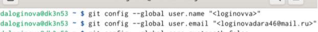
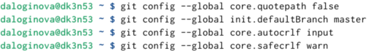
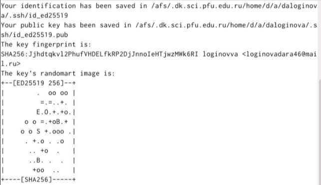
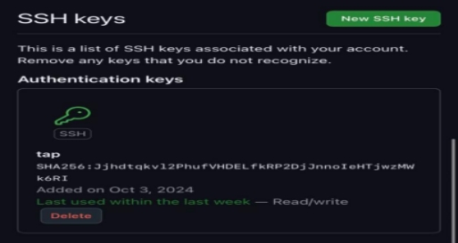
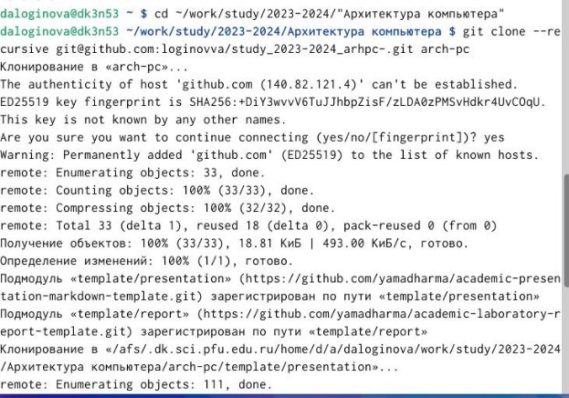
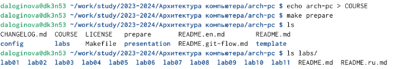
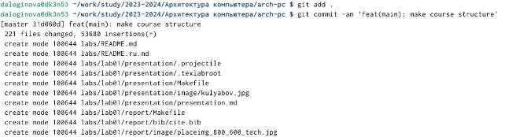
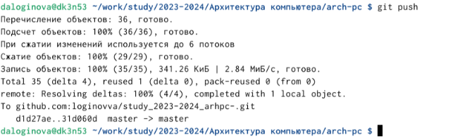
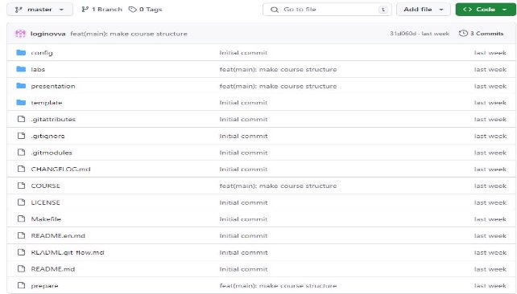

**РОССИЙСКИЙ УНИВЕРСИТЕТ ДРУЖБЫ НАРОДОВ** 

**Факультет физико-математических и естественных наук Кафедра прикладной информатики и теории вероятностей** 

**ОТЧЕТ**  

**ПО ЛАБОРАТОРНОЙ РАБОТЕ № 2** 

*дисциплина:  Архитектура компьютера *

Студент: Логинова Дарья Алексеевна         Группа: НБИбд-01-24         

**МОСКВА** 2024 г 

**Содержание**

[Цель работы ................................................................................................................................................. 3 ](#_page2_x54.00_y56.92)[Порядок выполнения работы................................................................................................................. 4 ](#_page3_x54.00_y56.92)

1. [Настройка github. ........................................................................................................................ 4 ](#_page3_x54.00_y109.92)
1. [Базовая настройка git. ............................................................................................................... 4 ](#_page3_x54.00_y182.92)
1. [Создание SSH ключа. ................................................................................................................ 4 ](#_page3_x54.00_y476.92)
1. [Создание рабочего пространства и репозитория курса на основе шаблона. ....... 5 ](#_page4_x331.00_y623.92)
1. [Создание репозитория курса на основе шаблона. .......................................................... 6 ](#_page5_x54.00_y79.92)
1. [Настройка каталога курса........................................................................................................ 6 ](#_page5_x54.00_y512.92)

[Вывод .............................................................................................................................................................. 8 ](#_page7_x54.00_y79.92)

**Цель работы** 

Изучить  идеологию  и  применение  средств  контроля  версий.  Приобрести практические навыки по работе с системой git. 

**Порядок выполнения работы** 

1. **Настройка github.** 

   Создадим учётную запись на сайте https://github.com/ и заполним основные 

данные. 

2. **Базовая настройка git.** 

Сделаем  предварительную  конфигурацию  git.  Откроем  терминал  и  введем следующие команды, указав имя и email. (рис.1) 

рис.1 

Настроим  utf-8  в  выводе  сообщений  git,  зададим  имя  начальной  ветки, параметр autocrlf и параметр safecrlf. (рис.2) 

рис.2 

3. **Создание SSH ключа.** 

Для  последующей  идентификации  пользователя  на  сервере  репозиториев сгенерируем пару ключей и загрузим сгенерённый открытый ключ. (рис.3) 

рис.3 

`  `Скопировав из локальной консоли ключ в буфер обмена, вставляем ключ в появившееся на сайте поле и указываем для ключа имя. (рис.4) 

рис.4 

4. **Создание  рабочего  пространства  и  репозитория  курса  на  основе шаблона.**

   Откроем  терминал  и  создадим  каталог  для  предмета  «Архитектура компьютера». (рис.5) 

   

рис.5 

5. **Создание репозитория курса на основе шаблона.** 

Откроем  терминал  и  перейдем  в  каталог  курса,  и  клонируем  созданный репозиторий. (рис.6) 

рис.6 

6. **Настройка каталога курса.** 

   Перейдем в каталог курса и удалим лишние файлы. (рис.7) 

рис.7 Создадим необходимые каталоги. (рис.8) 

Отправим файлы на сервер. (рис.9-10) 

рис.9 

рис.10 

Проверим  правильность  создания  иерархии  рабочего  пространства  в локальном репозитории и на странице github. (рис.11) 

рис.11 

**Вывод** 

В ходе работы я изучила идеологию и применение средств контроля версий   и приобрела практические навыки по работе с системой git. 
8 
