---
## Front matter
title: "ЛО5_Логинова"
subtitle: "Архитектура компьютеров"
author: "Логинова Дарья Алексеевна"

## Generic otions
lang: ru-RU
toc-title: "Содержание"

## Bibliography
bibliography: bib/cite.bib
csl: pandoc/csl/gost-r-7-0-5-2008-numeric.csl

## Pdf output format
toc: true # Table of contents
toc-depth: 2
lof: true # List of figures
lot: true # List of tables
fontsize: 12pt
linestretch: 1.5
papersize: a4
documentclass: scrreprt
## I18n polyglossia
polyglossia-lang:
  name: russian
  options:
	- spelling=modern
	- babelshorthands=true
polyglossia-otherlangs:
  name: english
## I18n babel
babel-lang: russian
babel-otherlangs: english
## Fonts
mainfont: IBM Plex Serif
romanfont: IBM Plex Serif
sansfont: IBM Plex Sans
monofont: IBM Plex Mono
mathfont: STIX Two Math
mainfontoptions: Ligatures=Common,Ligatures=TeX,Scale=0.94
romanfontoptions: Ligatures=Common,Ligatures=TeX,Scale=0.94
sansfontoptions: Ligatures=Common,Ligatures=TeX,Scale=MatchLowercase,Scale=0.94
monofontoptions: Scale=MatchLowercase,Scale=0.94,FakeStretch=0.9
mathfontoptions:
## Biblatex
biblatex: true
biblio-style: "gost-numeric"
biblatexoptions:
  - parentracker=true
  - backend=biber
  - hyperref=auto
  - language=auto
  - autolang=other*
  - citestyle=gost-numeric
## Pandoc-crossref LaTeX customization
figureTitle: "Рис."
tableTitle: "Таблица"
listingTitle: "Листинг"
lofTitle: "Список иллюстраций"
lotTitle: "Список таблиц"
lolTitle: "Листинги"
## Misc options
indent: true
header-includes:
  - \usepackage{indentfirst}
  - \usepackage{float} # keep figures where there are in the text
  - \floatplacement{figure}{H} # keep figures where there are in the text
---

# Цель работы

Приобретение практических навыков работы в Midnight Commander. Освоение инструкций
языка ассемблера mov и int.

# Задание

1. Создайте копию файла lab5-1.asm. Внесите изменения в программу (без использования внешнего файла in_out.asm), так чтобы она работала по следующему алгоритму:
• вывести приглашение типа “Введите строку:”;
• ввести строку с клавиатуры;
• вывести введённую строку на экран.
2. Получите исполняемый файл и проверьте его работу. На приглашение ввести строку
введите свою фамилию.
3. Создайте копию файла lab5-2.asm. Исправьте текст программы с использование подпрограмм из внешнего файла in_out.asm, так чтобы она работала по следующему
алгоритму:
• вывести приглашение типа “Введите строку:”;
• ввести строку с клавиатуры;
• вывести введённую строку на экран.
Не забудьте, подключаемый файл in_out.asm должен лежать в том же каталоге, что и
файл с программой, в которой он используется.
4. Создайте исполняемый файл и проверьте его работу

# Теоретическое введение

Здесь описываются теоретические аспекты, связанные с выполнением работы.

Например, в табл. [-@tbl:std-dir] приведено краткое описание стандартных каталогов Unix.

: Описание некоторых каталогов файловой системы GNU Linux {#tbl:std-dir}

| Имя каталога | Описание каталога                                                                                                          |
|--------------|----------------------------------------------------------------------------------------------------------------------------|
| `/`          | Корневая директория, содержащая всю файловую                                                                               |
| `/bin `      | Основные системные утилиты, необходимые как в однопользовательском режиме, так и при обычной работе всем пользователям     |
| `/etc`       | Общесистемные конфигурационные файлы и файлы конфигурации установленных программ                                           |
| `/home`      | Содержит домашние директории пользователей, которые, в свою очередь, содержат персональные настройки и данные пользователя |
| `/media`     | Точки монтирования для сменных носителей                                                                                   |
| `/root`      | Домашняя директория пользователя  `root`                                                                                   |
| `/tmp`       | Временные файлы                                                                                                            |
| `/usr`       | Вторичная иерархия для данных пользователя                                                                                 |

Более подробно про Unix см. в [@tanenbaum_book_modern-os_ru; @robbins_book_bash_en; @zarrelli_book_mastering-bash_en; @newham_book_learning-bash_en].

# Выполнение лабораторной работы

Откроем Midnight Commander и перейдем в созданный каталог. [-@fig:001]

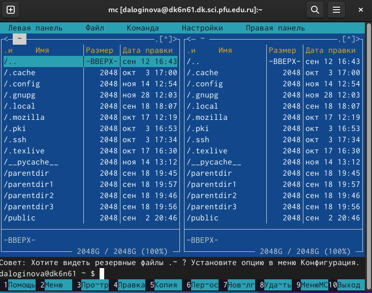{ width=100%}

Создадим папку lab05, перейдем в созданный каталог и создадим файл lab5-1.asm.  [-@fig:002]

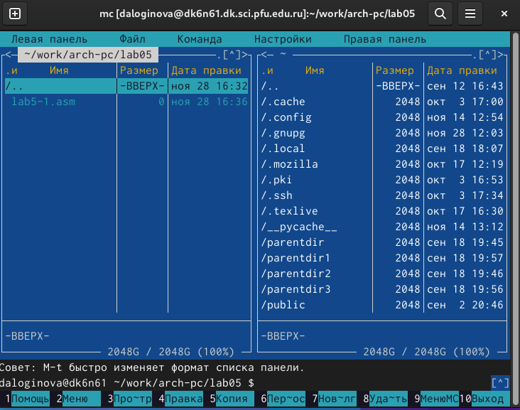{ width=100}

Откроем файл lab5-1.asm и введем текст программы из листинга 5.1. и убедимся, что файл содержит текст программы  [-@fig:003]

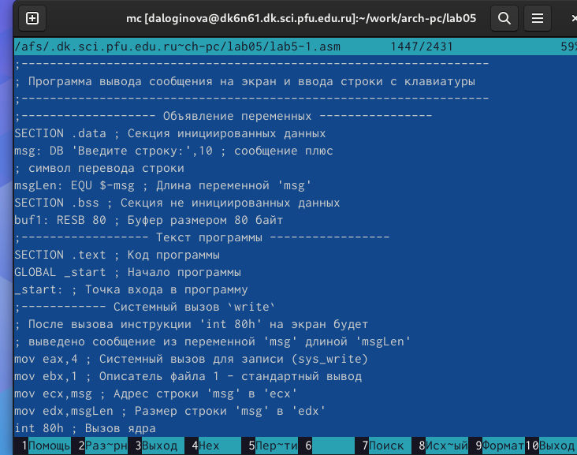{ width=100%}

Оттранслируем текст программы lab5-1.asm в объектный файл. Выполним компоновку объектного файла и запустим получившийся исполняемый файл.  [-@fig:004]

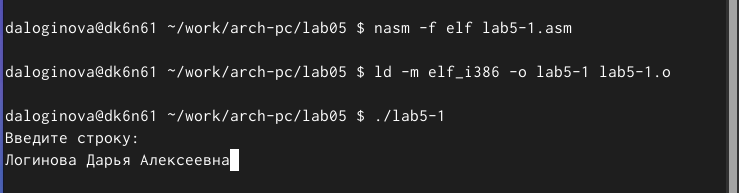{ width=100%}

 С помощью функциональной клавиши F6 создадим копию файла lab5-1.asm с именем
lab5-2.asm.[-@fig:005]

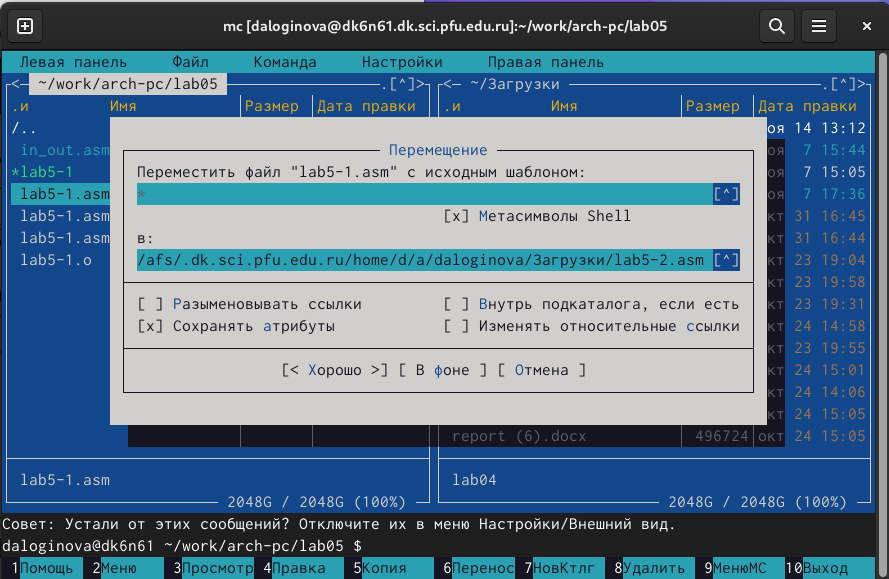{width=100%}

Исправим текст программы в файле lab5-2.asm с использование подпрограмм из
внешнего файла in_out.asm в соответствии с листингом 5.2. Создадим исполняемый файл и проверим его работу. [-@fig:006]

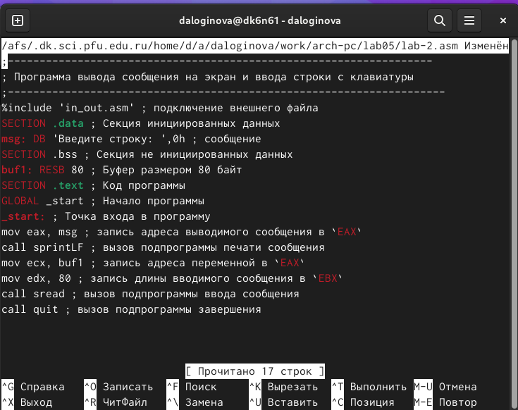{ width=100%}

В файле lab5-2.asm замените подпрограмму sprintLF на sprint. [-@fig:007]

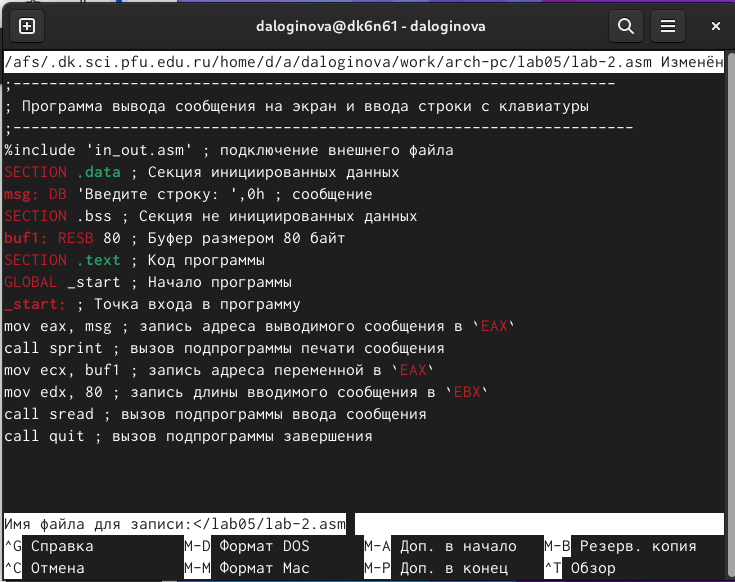{ width=100%}

Заметим, что строки вводятся по разному. [-@fig:008]

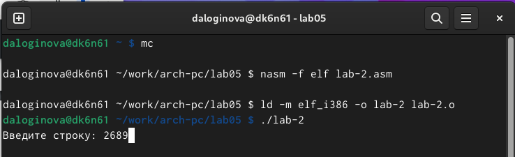{ width=100%}  [-@fig:009]

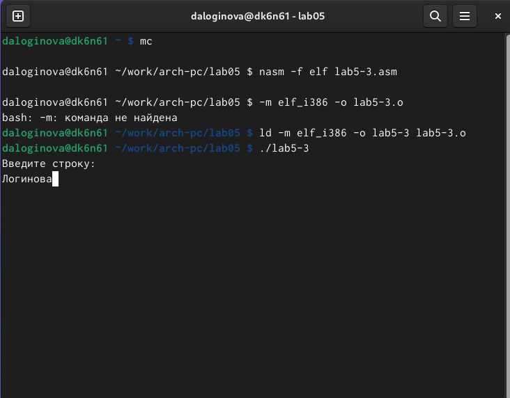{ width=100%}

Создадим копию файла lab5-1.asm. Внесите изменения в программу (без использования внешнего файла in_out.asm), так чтобы она работала по алгоритму.Получим исполняемый файл и проверим его работу.[-@fig:010]

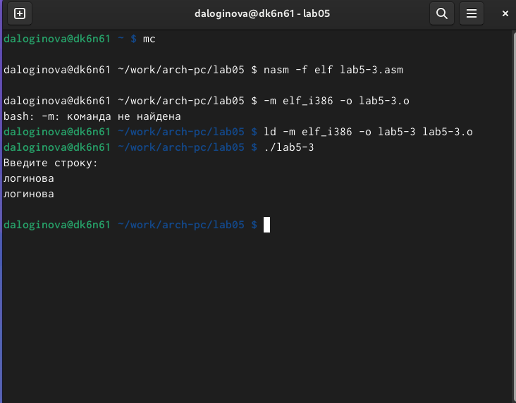{width=100%}  [-@fig:011]

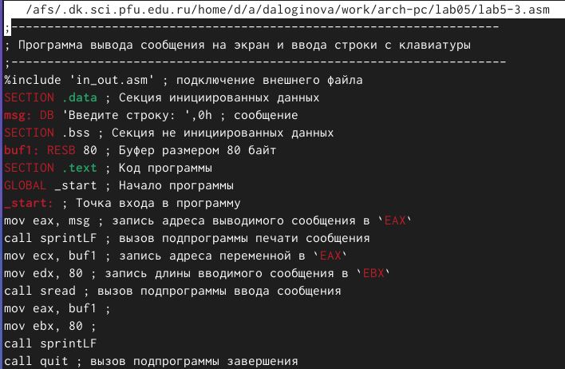{ width=100%} 

Создайте копию файла lab5-2.asm. Исправьте текст программы с использование подпрограмм из внешнего файла in_out.asm, так чтобы она работала по алгоритму.И проверим его работу. [-@fig:012]

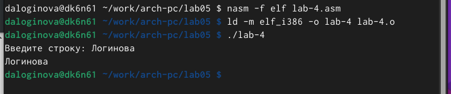{ width=100%}  [-@fig:013]

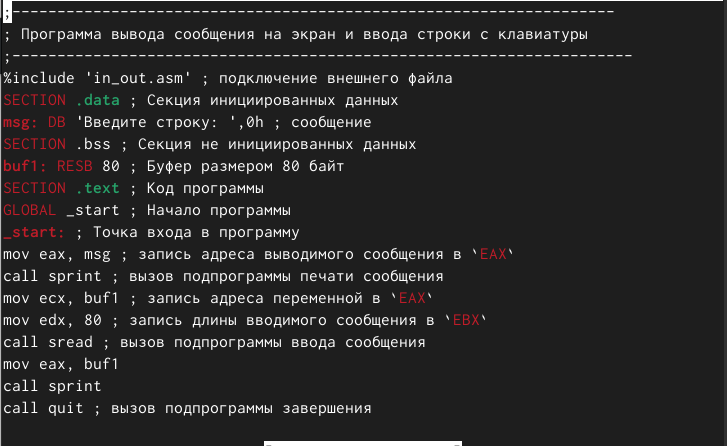{ width=100%} 

# Выводы

В ходе работы я приобрела практические навыки работы в Midnight Commander. Освоение инструкций
языка ассемблера mov и int.

# Список литературы{.unnumbered}

::: {#refs}
:::
